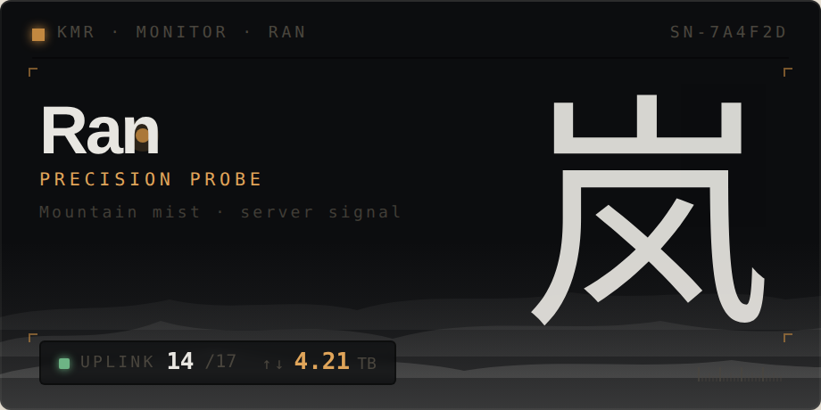
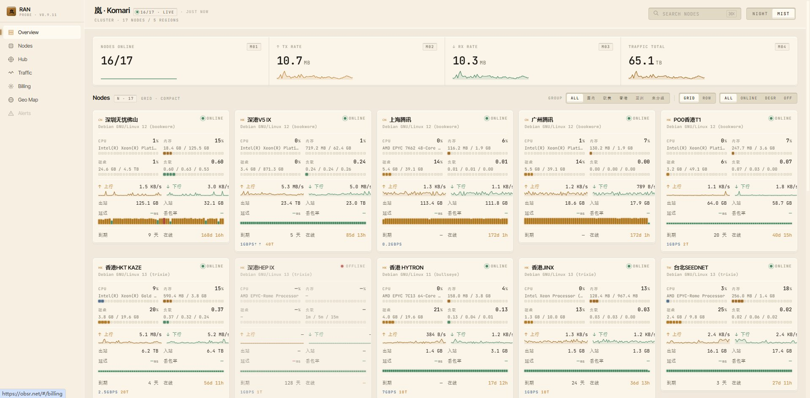
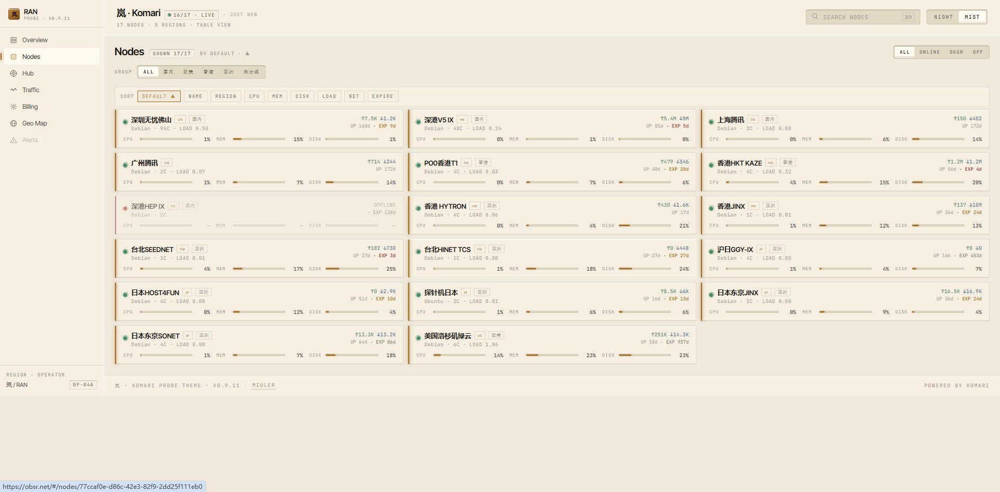
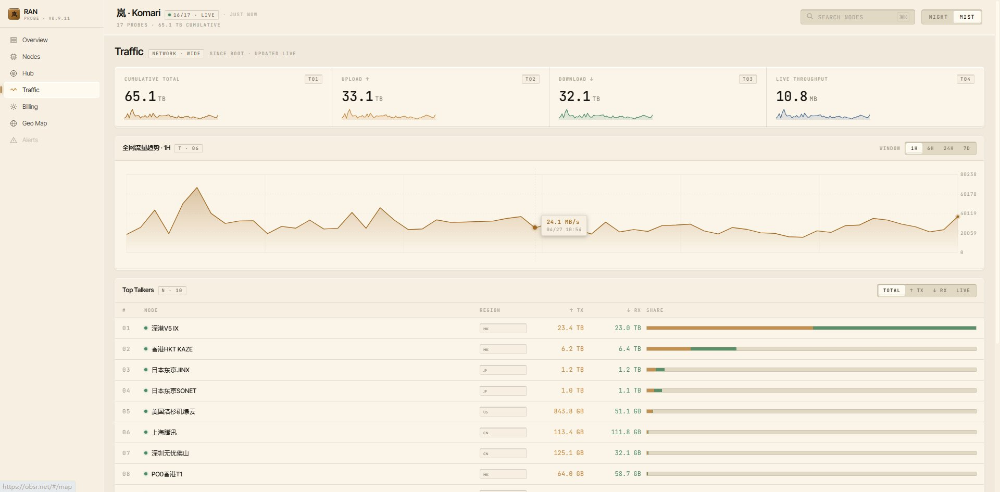
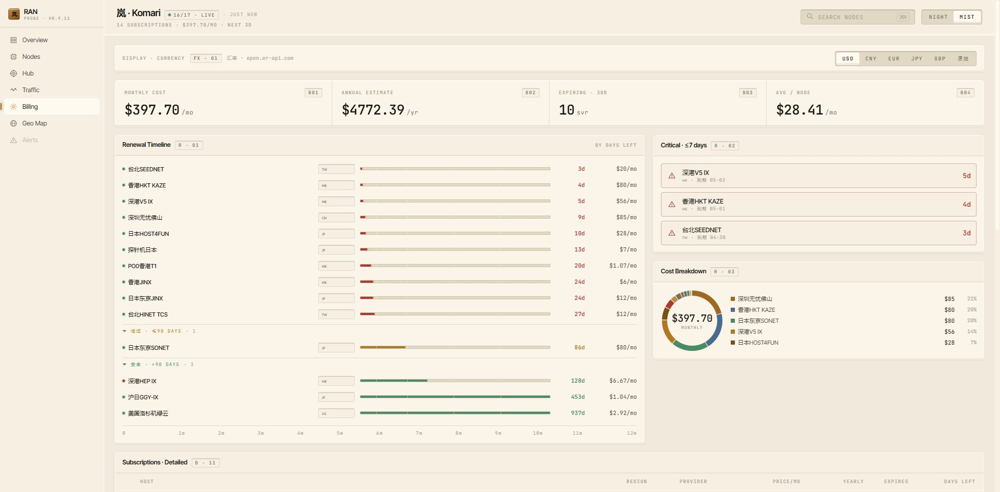

# 岚 (Ran) · Komari Probe Theme

> 精密金工质感的 Komari 探针面板主题
> Precision-machined hi-fi gear, rendered as a server monitoring panel.

[](https://github.com/saladinxp/komari-ran-theme/releases)
[](https://obsr.net)
[](#许可)



## 页面预览 · Pages

实站运行中:[**obsr.net**](https://obsr.net)

### Overview · 概览

顶部 4 大数(在线/上行/下行/累计流量)+ 节点紧凑卡网格,支持 `GRID/ROW`、`COMPACT/FULL` 切换以及按组、按状态过滤。



### Nodes · 节点列表

按 NAME / REGION / CPU / MEM / DISK / LOAD / NET / EXPIRE 排序;`DEFAULT` 尊重 Komari 后台拖动顺序(weight 字段)。



### Traffic · 全网流量

累计流量、上下行、实时吞吐 + 全网流量趋势(1H / 6H / 24H / 7D)+ Top Talkers 排行(`TOTAL / TX / RX / LIVE`)。



### Billing · 订阅汇总

月成本、年估算、≤30D 到期数、节点均价 + Renewal Timeline + Critical ≤7d Alerts + Cost Breakdown 饼图。支持 USD / CNY / EUR / JPY / GBP / 原始多币种切换,汇率走 [open.er-api.com](https://open.er-api.com)(5s 超时 + hardcoded fallback)。



### Geo Map · 全球节点地图

独立 HTML 页(`map.html`,从 sidebar `Geo Map` 进入),d3-geo + natural-earth 投影,中国居中。城市级坐标(中文名匹配 80+ 常见 IDC 城市,fallback 到国家中心),节点点位颜色区分在线/离线/当前活动节点(active probe 持续脉冲)。支持拖拽平移、滚轮/按钮缩放(1-8×)、双击 reset、节点 hover tooltip、国家 hover 高亮、鼠标坐标 readout。

> 截图待补。直接体验:[obsr.net/map.html](https://obsr.net/map.html)

### Mobile · 移动端

v1.0 起全面支持手机访问。Sidebar 在 < 768px 改为汉堡抽屉(slide-in + overlay + body scroll lock),Topbar 切换为 icon-only 紧凑模式,4 大数 stat 卡折成单列侧边布局(label/数字 + 自适应宽度 sparkline),Top Talkers 表格重排为 2 行卡片(NODE 一行 / TX·RX 一行,自动注入 ↑↓ 字符)。Geo Map 在窄屏改为说明卡片引导回桌面端(触屏拖拽与页面滑动手势冲突)。所有页面内 padding 收紧并支持 iOS `env(safe-area-inset-*)` 处理刘海与底部 home indicator。

> 真机截图(iPhone Safari, obsr.net)待补。

## 设计理念

灵感来自 Astell&Kern 等精密 HiFi 器材的 CNC 数控加工外观:阶梯倒角、蚀刻铭牌、凹陷显示窗、真 1px 发丝线。**每一根边线都有理由**。

- **双 hairline 倒角** — 外亮内暗,模拟金属倒角
- **凹陷读数窗(precision-inset)** — 数据展示区下沉,有阴影
- **蚀刻铭牌字(Etch)** — 9px 等宽 uppercase wide-tracking
- **接缝装饰(seam)** — 模拟硬件拼接缝
- **GPU 友好的微动效** — 状态点呼吸、scan 等轻量动画,无重资源消耗
- **`prefers-reduced-motion`** — 尊重无障碍设置
- **真响应式** — 桌面 / 平板 / 手机三段断点,sidebar 抽屉化、HeroStats 自适应列数、Top Talkers 卡片重排、iOS safe-area

## 主题变体

| | 名称 | 用途 |
|---|---|---|
| 🌑 | **墨石 ran-night** | 深色 |
| 🌫️ | **雾色 ran-mist** | 暖奶油浅色,默认 |

切换可在右上角 NIGHT/MIST 按钮,或由 Komari 主题设置默认值。

## 路由

| 路由 | 内容 |
|---|---|
| `#/overview` | 顶部 4 stat + 节点卡网格/行,组/状态过滤 |
| `#/nodes` | 节点全列表,按 NAME/REGION/CPU/MEM/LOAD/NET/EXPIRE 排序 |
| `#/nodes/{uuid}` | 单节点详情,4 chart × 1H/6H/24H/7D 时长选择 |
| `#/hub/{uuid}` | 单节点 Hub 驾驶舱(进阶模块,响应式 3/2/1 列) |
| `#/traffic` | 全网流量,Top Talkers,区域分布 |
| `#/billing` | 订阅汇总,Renewal Timeline,Cost Trend·12M,By Continent |
| `map.html` | 独立地图页,d3-geo + natural-earth + 城市级节点点位 + 缩放交互 |

## 安装

前往 [Releases](https://github.com/saladinxp/komari-ran-theme/releases) 下载最新 zip,在 Komari 后台 → 主题管理 → 上传主题 应用。

## Billing 字段要求

Billing 页要工作,节点要在 Komari 后台填这几个字段(都没填也不会报错,Billing 页会显示空状态引导):

| 字段 | 类型 | 例 |
|---|---|---|
| `price` | number | `12` (月费) / `-1` (免费/终身) |
| `billing_cycle` | number (天) | `30` 月 / `90` 季 / `365` 年 / `1095` 三年 |
| `currency` | string (符号) | `$` / `¥` / `€` / `£` |
| `expired_at` | ISO 日期 | `2025-12-31` |

¥ 符号歧义(CNY 还是 JPY)用启发式判断:月费 > 100 视为 JPY,否则 CNY。

## 数据接入

主题部署后默认连同源的 Komari API:

- `GET /api/nodes` — 节点列表
- `GET /api/public` — 站点配置(站点名、retention 等)
- `GET /api/records/load?uuid=X&hours=N` — 单节点负载历史
- `GET /api/records/ping?uuid=X&hours=N` — 单节点 ping 历史
- `WebSocket /api/clients` — 实时数据,1s 间隔轮询(请求-响应模式),自动重连

API 不可达时(如本地 `npm run dev` 单独跑),会自动切到 mock 数据预览。

## 开发

```bash
npm install
npm run dev          # Vite HMR
npm run build        # 生成 dist/index.html + dist/map.html
                     # (各自单文件内联,主入口 + Geo Map 独立页)
```

开发时可设置 `VITE_KOMARI_BASE` 指向已部署的 Komari 实例:

```bash
VITE_KOMARI_BASE=https://your-komari.com npm run dev
```

发版打包(给 Komari 用的 zip):

```bash
npm run build
zip -rq komari-ran-vX.Y.Z.zip komari-theme.json preview.png dist/
```

## 技术栈

- **Vite + `vite-plugin-singlefile`** — 单文件 HTML 产物;双 entry(`index.html` + `map.html`)
- **React 19 + TypeScript** — 30+ 模块化文件源 → 两个独立 dist HTML
- **Hash 路由** — Komari 嵌入环境最稳的路由方式
- **CSS 变量 + `@media`** — 双主题切换零 JS,`data-theme` 属性切换;响应式断点契约写在 tokens.css(`--bp-sm/md/lg`)+ `useMediaQuery` hook,二者互为单源
- **d3-geo + topojson-client + world-atlas** — Geo Map 投影与渲染(仅地图页加载)

## 许可

MIT

## 作者

[Miuler](https://github.com/saladinxp) · [obsr.net](https://obsr.net)
